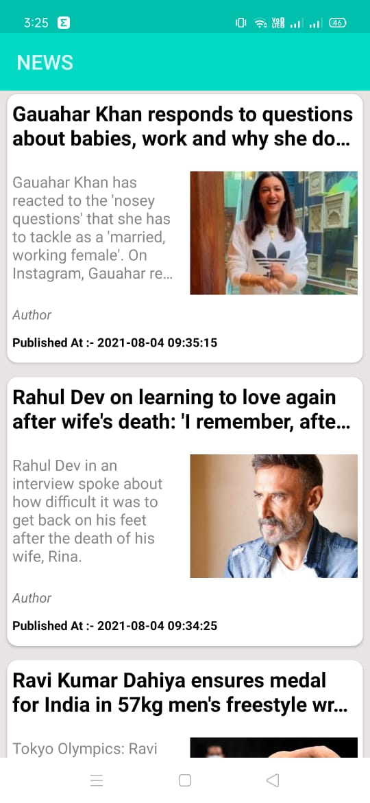

# News App
This app displays a list of recent Top News in the world
from the newsdata.io website

More info on the News data REST API available at:
https://newsdata.io/

## Feature
* Swipe Down to Refresh the Page and get new Top News


## Note:
Get the newsdata.io API key before running the app and add it in the REQUEST_NEWS_URL Variable under NewsActivity.java


## Pre-requisites
- Android SDK v23
- Android Build Tools v23.0.2
- Android Support Repository v23.3.0


## Installation
Clone this repository and import into **Android Studio**
```bash
git clone https://github.com/neelangshu007/News-App.git
```

## Getting Started
This sample uses the Gradle build system. To build this project, use the
"gradlew build" command or use "Import Project" in Android Studio.


## Contributing
1. Fork it
2. Create your feature branch (git checkout -b my-new-feature)
3. Commit your changes (git commit -m 'Add some feature')
4. Push your branch (git push origin my-new-feature)
5. Create a new Pull Request

## News App Screenshots





